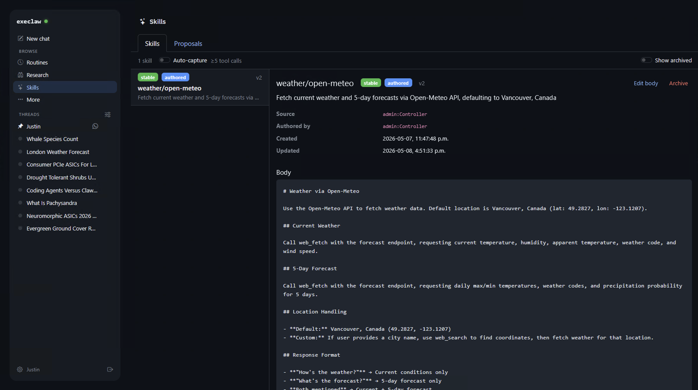
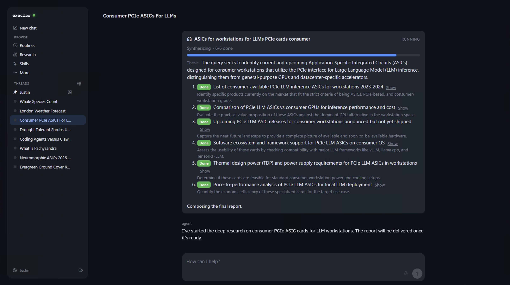

# execlaw

Self-hosted Rust agent framework with persistent memory, hook-based plugins,
tools, and skills. **No cloud LLMs, ever.** All inference runs on operator
hardware.

<p align="center">
  
  
</p>

## Documentation

| Doc | What it covers |
|---|---|
| [`docs/architecture.md`](docs/architecture.md) | System topology, design principles, FSM, data model, recovery, observability — the **what**. |
| [`docs/agent-model.md`](docs/agent-model.md) | TurnExecutor, memory layers, reflection loop, planner/executor split — the **how** of one turn. |
| [`docs/plugins.md`](docs/plugins.md) | Plugin manifest schema, runtime tiers, sidecar model, Rhai primitives, and a step-by-step guide for writing a custom plugin. |
| [`docs/sidecar-supervisor-design.md`](docs/sidecar-supervisor-design.md) | Supervised-container layer plugins compose against. |
| [`docs/runner-design.md`](docs/runner-design.md) | Per-conversation runner container model. |
| [`docs/voice-followups.md`](docs/voice-followups.md) | Voice modality design notes. |
| [`AGENTS.md`](AGENTS.md) | Onboarding for AI coding agents working on this repo. |

## What ships today

- **Control plane** (Rust binary): event log + scheduler + plugin host + container manager + outbox relay + axum server + SQLCipher vault.
- **Per-conversation runner containers**: stateless against the log, stateless OpenAI-compatible client to local inference (vLLM / OpenArc / Whisper / Kokoro).
- **Trust ladder + Rule of Two**: `Controller / Delegated / KnownTrusted / KnownLimited / UnknownPending / Blocked` with cold-contact escalation, signed approval-token JWTs, sideband HITL.
- **HMAC-chained event log**: every committed row is tamper-evident; replay rebuilds state deterministically.
- **Outbox + idempotency**: framework-minted `(conversation_id, turn_seq, tool_call_ordinal)` keys, retries with backoff, dead-letter queue.
- **Plugin framework** (10 in-tree plugins): script-tier (Rhai) + subprocess-tier (JSON-RPC), full manifest schema (tools / transports / identity providers / OAuth / sidecars / admin routes / webhook routes / UI panels / skills).
- **Shipped transports**: Signal (signal-cli sidecar), WhatsApp (wuzapi sidecar), Slack (multi-workspace OAuth), SMS (Android-gateway WebSocket).
- **Shipped HTTP integrations**: Google Calendar, Google Contacts (also identity provider), Google Places, Pushover.
- **Research subsystem**: deep-research plan/gather/synthesize pipeline with retention and per-phase event flow.
- **SPA**: chat-first sidebar, pinned Control thread (every controller-channel message collapses here), token streaming, approval queue, per-plugin admin panels, settings.

See [`docs/architecture.md` §18](docs/architecture.md) for the full milestone breakdown.

## Screenshots

Drop UI screenshots into [`docs/screenshots/`](docs/screenshots/) and reference them inline below as the SPA evolves.

```markdown


```

`docs/screenshots/.gitkeep` keeps the directory tracked even when empty. PNG / SVG / WebP all work; keep them under ~500 KB each. The doc's existing inline examples cite `docs/screenshots/*` paths, so new shots only need to drop in.

---

## Minimum requirements

execlaw is **self-hosted by design** — there is no SaaS tier, no cloud
fallback, and no plan for one. Inference happens on the operator's own
hardware against a local OpenAI-compatible endpoint. The hardware
floor is set by the LLM you choose to run, not by execlaw itself.

### Operating system

| Platform | Status | Service backend |
|---|---|---|
| Linux x86_64 (Ubuntu 22.04+, Debian 12+, Fedora 39+, Arch, …) | Supported | systemd |
| macOS x86_64 (Intel) | Supported | launchd |
| macOS arm64 (Apple Silicon, M1+) | Supported | launchd |
| Windows 10 / 11 (x86_64, MSVC toolchain) | Supported | Service Control Manager |

Service registration is handled by the
[`service-manager`](https://crates.io/crates/service-manager) crate —
`execlaw install` picks the right backend per platform.

### GPU / inference acceleration

You need a GPU capable of running the LLM you intend to use. The
in-tree default is **Qwen3.5-27B-AWQ** (~14 GB VRAM for weights + a
working KV cache budget for ~8K-token contexts). Two acceleration paths
are supported out-of-the-box:

| Path | Hardware | Backend container | Typical floor |
|---|---|---|---|
| **NVIDIA CUDA** | RTX 30-series or newer with **≥16 GB VRAM** | `service-vllm` (vLLM) | RTX 4090 / 3090 / A4000 |
| **Intel Arc / Xeon** | Arc A770 / B580, Battlemage, Xeon w/ AMX | `service-openarc` (OpenVINO) | Arc A770 16 GB |

CPU-only inference is technically possible via llama.cpp or similar
sidecars, but at 27B-AWQ the latency makes the agent loop unusable.
Smaller models (Qwen2.5-7B-AWQ at ~5 GB VRAM) work on consumer 8 GB
cards if you accept the quality drop — operators swap the model spec
in Settings → Backends.

The voice subsystem (Whisper STT, Kokoro TTS) runs alongside the LLM —
add ~1-2 GB VRAM headroom if you want both on the same card. Operators
with a second GPU (typical Intel-Arc-for-voice + NVIDIA-for-LLM split)
can pin each backend per-card via Settings → Runners.

### Memory + disk

| Resource | Floor | Comfortable |
|---|---|---|
| System RAM | 16 GB | 32 GB |
| Free disk for `~/.execlaw/` | 2 GB | 10 GB (DB + log retention + plugin sidecar volumes) |
| Free disk for Docker images | 30 GB | 80 GB+ (LLM weights dominate; vLLM + Whisper + Kokoro + plugin sidecars) |

### Required runtime dependencies

- **[Docker](https://docs.docker.com/engine/install/)** — required for
  per-conversation runner containers, plugin sidecars (signal-cli,
  wuzapi, …), and managed-mode inference backends. The control plane
  talks to the local Docker daemon via the standard socket
  (`/var/run/docker.sock` on Linux/macOS, `\\.\pipe\docker_engine` on
  Windows). Docker Desktop is fine on macOS/Windows; Docker Engine or
  Podman-with-the-docker-socket-shim works on Linux. **Without
  Docker the agent loop runs text-only with the runner in-process;
  sidecars and managed inference are unavailable** — usable for plain
  chat but not for the bridged-transport plugins.
- **An NVIDIA or Intel GPU driver stack** matching the inference path
  you choose — CUDA 12+ runtime for NVIDIA, the OpenVINO drivers for
  Intel. Both are normally installed alongside the GPU; `execlaw doctor`
  prints what's missing.
- **An OS keyring backend** for vault master-key storage — Keychain
  on macOS, Credential Manager on Windows, Secret Service / KWallet
  on Linux. The vault falls back to `~/.execlaw/master.key` if the
  keyring is unavailable; the file fallback is also the durable sink
  on Windows where Credential Manager has documented drift issues
  (see [`docs/security.md`](docs/security.md) §5).

### Build-from-source dependencies

Only required if you're compiling rather than installing a release
binary:

- **Rust 1.85+** (edition 2024). MSRV documented at the workspace root;
  CI runs against current stable.
- **Node.js 20+** for the SPA build (`web/`).
- **A C toolchain** for the SQLite bundling: `gcc`/`clang` on
  Linux/macOS, MSVC on Windows.
- **Strawberry Perl 5.32+** on Windows *only* if you build the
  production `sqlcipher` feature (vendored OpenSSL needs Perl). Not
  required for default `bundled-sqlite-plain` dev builds.

`execlaw doctor` runs preflight checks for all of the above and prints
remediation pointers per platform.

---

## Quick start (production)

execlaw's control plane runs as a host service on bare metal —
systemd on Linux, launchd on macOS, the Service Control Manager on
Windows. The control plane itself is a single native binary; Docker
is required only for the things the control plane spawns *out* (per-
conversation runner containers, plugin sidecars like signal-cli /
wuzapi, managed-mode inference backends). On a host without Docker
the agent loop still works text-only with the runner running
in-process; sidecars and managed inference are unavailable.

### One-shot install

```bash
cargo install --path crates/cli   # or `cargo build --release` and copy the binary
execlaw install                   # migrate DB → register service → start it
curl http://127.0.0.1:3031/api/health    # → {"status":"ok"}
open  http://127.0.0.1:3031/api/docs     # Swagger + AsyncAPI
```

`execlaw install` registers a per-user service by default. Add
`--system` for a system-wide install (root / Administrator). On
Windows the Service Control Manager always runs system-level, so
`--system` is implied.

### Service lifecycle

| Command | What it does |
|---|---|
| `execlaw install` | First-run: migrate + register + start |
| `execlaw service install` | Register (without starting) |
| `execlaw service start` | Start the service |
| `execlaw service restart` | Stop + start |
| `execlaw service stop` | Stop the service |
| `execlaw service status` | Print install state + per-OS log commands |
| `execlaw service uninstall` | Deregister |
| `execlaw doctor` | Preflight checks (DB, vault, optional Docker) |
| `execlaw serve` | Run in the foreground (dev / debug) |

`cargo bootstrap`, `cargo start`, `cargo stop`, `cargo restart`,
`cargo svc-status`, and `cargo doctor` are convenience aliases that
forward to the equivalent `execlaw …` invocations
(see `.cargo/config.toml`).

### Live logs

| OS | Command |
|---|---|
| Linux (user) | `journalctl --user -u execlaw -f` |
| Linux (system) | `journalctl -u execlaw -f` |
| macOS | `log stream --predicate 'process == "execlaw"'` |
| Windows | `Get-EventLog -Source execlaw -LogName Application` |

`execlaw service status` prints the right command for your platform.

### First-run setup

```bash
curl -X POST http://127.0.0.1:3031/api/setup \
  -H 'content-type: application/json' \
  -d '{"admin_password":"pick-something-longer"}'
```

The SPA at `http://127.0.0.1:3031/` will guide you through the rest
(backend wizard, plugin install, personality, etc.).

---

## Dev mode (hot-reload, full stack)

Two long-running processes give you a restart-free edit cycle for both
the Rust server and the SPA.

### One-time setup

```bash
# Rust file-watcher.
cargo install cargo-watch --locked

# SPA dependencies.
cd web && npm install
```

### Run both terminals

```bash
# Terminal 1 — Rust hot-reload. cargo-watch rebuilds + restarts the
# binary on every .rs save. Wraps `cargo run -p execlaw -- serve`.
bash scripts/dev-server.sh         # POSIX / WSL / Git Bash on Windows
# or:
pwsh scripts/dev-server.ps1        # Windows PowerShell
# or, from inside web/:
cd web && npm run dev:server       # alias for the bash script

# Terminal 2 — SPA hot-reload. Vite HMR; proxies /api → :3031.
cd web && npm run dev
```

Open <http://127.0.0.1:5173/> — the SPA hits the Vite dev server, which
proxies API calls to the cargo-watch'd Rust binary on `:3031`. Editing
a `.tsx` file triggers a Vite HMR push; editing a `.rs` file triggers
a `cargo build` + binary restart and the next API call hits the new
code (typically <5s for incremental edits).

The dev server, the installed production service, and the Vite proxy
all default to `127.0.0.1:3031` — there's no port-swizzling between
modes. Override for one-off testing:

```bash
EXECLAW_DEV_BIND=127.0.0.1:9000 bash scripts/dev-server.sh
VITE_API_TARGET=http://127.0.0.1:9000 npm run dev
```

### Useful npm scripts (in `web/`)

| Script | What it does |
|---|---|
| `npm run dev` | Vite dev server with HMR on `:5173`. Proxies `/api → :3031`. |
| `npm run dev:server` | Forwards to `bash ../scripts/dev-server.sh` so you can launch the Rust server from inside `web/`. |
| `npm run build` | Production SPA bundle (`web/dist/`). |
| `npm run preview` | Serve the built bundle locally. |
| `npm test` / `npm run test:watch` | Vitest. |
| `npm run lint` | `tsc --noEmit`. |
| `npm run size` | Print bundle-size budget snapshot. |

### Rust dev cheatsheet

```bash
# Plaintext SQLite path (fast; skips OpenSSL vendoring).
cargo test --workspace
cargo run -p execlaw -- doctor

# Full SQLCipher path (production build).
cargo test --workspace --no-default-features -F execlaw-core/sqlcipher

# Replay a turn — reconstructs the exact prompt, capability set,
# policy decision, and committed events for one conversation/seq.
cargo run -p execlaw -- replay <conversation_id> --at <seq>
```

Requires Rust 1.85+ (edition 2024). Bare-metal targets:
`x86_64-unknown-linux-gnu`, `x86_64-pc-windows-msvc`,
`x86_64-apple-darwin`, `aarch64-apple-darwin`. Service registration
on each is handled by the
[`service-manager`](https://crates.io/crates/service-manager) crate.

### Disk-space note

The Rust workspace's `target/` directory grows quickly (40+ GB on a
warm dev box). If `cargo-watch` rebuilds start failing with
`No space left on device`, run `cargo clean` to reclaim.

---

## Workspace layout

| Path | Purpose |
|---|---|
| `crates/core/` | Event log, FSM, migrations (35+ incremental), SQLCipher-encrypted storage, principal store, memory lifecycle. |
| `crates/session/` | Per-conversation pipeline composition (text vs voice). |
| `crates/inference-api/` | OpenAI-compatible LLM client. **No cloud SDKs.** |
| `crates/runner-local/` | TurnExecutor — full tool-loop turn path. |
| `crates/voice-pipeline/` | STT → LLM → TTS two-lane Tokio graph. |
| `crates/plugin-sdk/` | `plugin.toml` manifest parser + ZIP staging. |
| `crates/plugin-host/` | Plugin registry + lifecycle (install / enable / disable / hydrate). |
| `crates/script/` | Embedded Rhai engine + primitive bindings (HTTP, sidecar, vault, OAuth, WS, routing, JSON, time). |
| `crates/container-manager/` | bollard client + tiered hardware detection. |
| `crates/policy/` | Rule of Two, capability tokens, input guards, spotlighting. |
| `crates/vault/` | OS-keyring master key + Argon2id admin password. |
| `crates/transport-api/` | Trait a transport plugin implements. |
| `crates/identity-api/` | Trait an identity-provider plugin implements. |
| `crates/outbox/` | Outbox relay primitives (idempotency, retry, dead-letter). |
| `crates/server/` | Axum HTTP + WebSocket surface, sidecar supervisor, admin/webhook routers, chat path. |
| `crates/mcp-client/` | MCP server registration + tool dispatch (alternative to plugin tools). |
| `crates/cli/` | `execlaw` binary (install, service, doctor, serve, replay, eval, …). |
| `crates/eval-harness/` | LLM-judge harness against local Qwen. |
| `plugins/` | In-tree reference + first-party plugins (signal, whatsapp, slack, sms-socket, google-*, pushover, hello, identity-local-address-book). |
| `web/` | React + react-bootstrap SPA. Vite + Vitest. |
| `scripts/` | `dev-server.sh` / `dev-server.ps1` — cargo-watch wrappers. |
| `docs/` | Architecture + agent-model + plugins + screenshots. |
| `evals/` | Rubric TOML files for the LLM-judge harness. |
| `spec/` | OpenAPI + AsyncAPI specs. |

## License

Apache License, Version 2.0 — see [`LICENSE`](LICENSE) and
[`NOTICE`](NOTICE).

Copyright (c) 2026 Justin Long.
